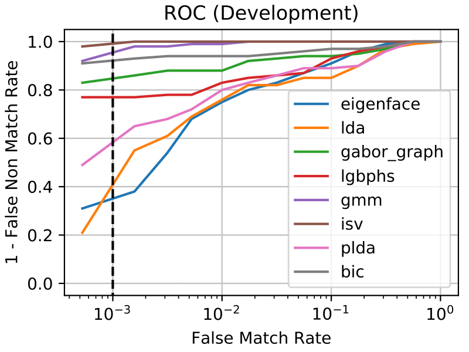
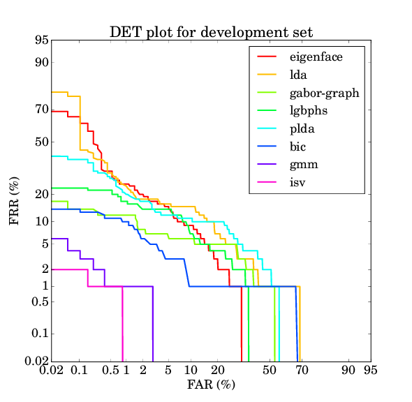
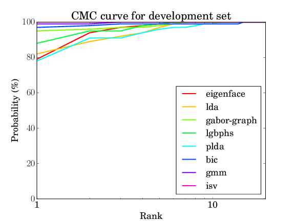

.. vim: set fileencoding=utf-8 :
.. author: Manuel Günther <manuel.guenther@idiap.ch>
.. date: Thu Sep 20 11:58:57 CEST 2012

.. _bob.bio.face.baselines:

=============================
Executing Baseline Algorithms
=============================

The first thing you might want to do is to execute one of the baseline face recognition algorithms that are implemented in ``bob.bio``.

Setting up your Database
------------------------

As mentioned in the documentation of :ref:`bob.bio.base <bob.bio.base>`, the image databases are not included in this package, so you have to download them.
For example, you can easily download the images of the `AT&T database`_, for links to other utilizable image databases please read the :ref:`bob.bio.face.databases` section.

By default, ``bob.bio`` does not know, where the images are located.
Hence, before running experiments you have to specify the image database directories.
How this is done is explained in more detail in the :ref:`bob.bio.base.installation`.

Running Baseline Experiments
----------------------------

To run the baseline experiments, you can use the ``./bin/baselines.py`` script by just going to the console and typing:

.. code-block:: sh

   $ ./bin/baselines.py

This script is a simple wrapper for the ``./bin/verify.py`` script that is explained in more detail in :ref:`bob.bio.base.experiments`.
The ``./bin/baselines.py --help`` option shows you, which other options you have.
Here is an almost complete extract:

* ``--database``: The database and protocol you want to use.
  By default this is set to the image database *atnt*.
* ``--algorithms``: The recognition algorithms that you want to execute.
  By default, only the *eigenface* algorithm is executed.
* ``--all``: Execute all algorithms that are implemented.
* ``--temp-directory``: The directory where temporary files of the experiments are put to.
* ``--result-directory``: The directory where resulting score files of the experiments are put to.
* ``--evaluate``: After running the experiments, the resulting score files will be evaluated, and the result is written to console.
* ``--dry-run``: Instead of executing the algorithm (or the evaluation), only print the command that would have been executed.
* ``--verbose``: Increase the verbosity level of the script.
  By default, only the commands that are executed are printed, and the rest of the calculation runs quietly.
  You can increase the verbosity by adding the ``--verbose`` parameter repeatedly (up to three times).

Usually it is a good idea to have at least verbose level 2 (i.e., calling ``./bin/baselines.py --verbose --verbose``, or the short version ``./bin/baselines.py -vv``).

Running in Parallel
~~~~~~~~~~~~~~~~~~~

To run the experiments in parallel, as usual you can define an SGE grid configuration, or run with parallel threads on the local machine.
For the ``./bin/baselines.py`` script, the grid configuration is adapted to each of the algorithms.
Hence, to run in the SGE grid, you can simply add the ``--grid`` command line option, without parameters.
Similarly, to run the experiments in parallel on the local machine, simply add a ``--parallel <N>`` option, where ``<N>`` specifies the number of parallel jobs you want to execute.

When running the algorithms from the :ref:`bob.bio.gmm <bob.bio.gmm>` package in parallel, the specialized scripts are executed.
This will speed up the training of the UBM (and possible additional steps) tremendously.

The Algorithms
--------------

The algorithms present an (incomplete) set of state-of-the-art face recognition algorithms. Here is the list of short-cuts:

* ``eigenface``: The eigenface algorithm as proposed by [TP91]_. It uses the pixels as raw data, and applies a *Principal Component Analysis* (PCA) on it:

  - preprocessor : :py:class:`bob.bio.face.preprocessor.FaceCrop`
  - feature : :py:class:`bob.bio.base.extractor.Linearize`
  - algorithm : :py:class:`bob.bio.base.algorithm.PCA`

* ``lda``: The LDA algorithm applies a *Linear Discriminant Analysis* (LDA), here we use the combined PCA+LDA approach [ZKC+98]_:

  - preprocessor : :py:class:`bob.bio.face.preprocessor.FaceCrop`
  - feature : :py:class:`bob.bio.face.extractor.Eigenface`
  - algorithm : :py:class:`bob.bio.base.algorithm.LDA`

* ``gaborgraph``: This method extract grid graphs of Gabor jets from the images, and computes a Gabor phase based similarity [GHW12]_.

  - preprocessor : :py:class:`bob.bio.face.preprocessor.INormLBP`
  - feature : :py:class:`bob.bio.face.extractor.GridGraph`
  - algorithm : :py:class:`bob.bio.face.algorithm.GaborJet`

* ``lgbphs``: *Local Gabor Binary Pattern Histogram Sequences* (LGBPHS) [ZSG+05]_ are extracted from the images and compares using the histogram intersection measure:

  - preprocessor : :py:class:`bob.bio.face.preprocessor.TanTriggs`
  - feature : :py:class:`bob.bio.face.extractor.LGBPHS`
  - algorithm : :py:class:`bob.bio.face.algorithm.LGBPHS`

* ``plda``: *Probabilistic LDA* (PLDA) [Pri07]_ is a probabilistic generative version of the LDA, in its scalable formulation of [ESM+13]_.
  Here, we also apply it on pixel-based representations of the image, though also other features should be possible.

  - preprocessor : :py:class:`bob.bio.face.preprocessor.FaceCrop`
  - feature : :py:class:`bob.bio.base.extractor.Linearize`
  - algorithm : :py:class:`bob.bio.base.algorithm.PLDA`

* ``bic``: In the *Bayesian Intrapersonal/Extrapersonal Classifier* (BIC) [MWP98]_, a gabor-grid-graph based similarity vector is classified to be intrapersonal (i.e., both images are from the same person) or extrapersonal, as explained in [GW09]_.

  - preprocessor : :py:class:`bob.bio.face.preprocessor.FaceCrop`
  - feature : :py:class:`bob.bio.face.extractor.GridGraph`
  - algorithm : :py:class:`bob.bio.base.algorithm.BIC`

.. note::
  The ``plda`` algorithm is currently under construction and the setup is not yet useful.

Further algorithms are available, when the :ref:`bob.bio.gmm <bob.bio.gmm>` package is installed:

* ``gmm``: *Gaussian Mixture Models* (GMM) [MM09]_ are extracted from *Discrete Cosine Transform* (DCT) block features.

  - preprocessor : :py:class:`bob.bio.face.preprocessor.TanTriggs`
  - feature : :py:class:`bob.bio.face.extractor.DCTBlocks`
  - algorithm : :py:class:`bob.bio.gmm.algorithm.GMM`

* ``isv``: As an extension of the GMM algorithm, *Inter-Session Variability* (ISV) modeling [WMM+11]_ is used to learn what variations in images are introduced by identity changes and which not.

  - preprocessor : :py:class:`bob.bio.face.preprocessor.TanTriggs`
  - feature : :py:class:`bob.bio.face.extractor.DCTBlocks`
  - algorithm : :py:class:`bob.bio.gmm.algorithm.ISV`

* ``ivector``: Another extension of the GMM algorithm is *Total Variability* (TV) modeling [WM12]_ (aka. I-Vector), which tries to learn a subspace in the GMM super-vector space.

  - preprocessor : :py:class:`bob.bio.face.preprocessor.TanTriggs`
  - feature : :py:class:`bob.bio.face.extractor.DCTBlocks`
  - algorithm : :py:class:`bob.bio.gmm.algorithm.IVector`

.. note::
  The ``ivector`` algorithm needs a lot of training data and fails on small databases such as the `AT&T database`_.

Additionally, the following algorithms can be executed, when the :ref:`bob.bio.csu <bob.bio.csu>` package is installed.

* ``lrpca``: In Local Region PCA [PBD+11]_, the face is sub-divided into local regions and a PCA is performed for each local region.

  - preprocessor : :py:class:`bob.bio.csu.preprocessor.LRPCA`
  - feature : :py:class:`bob.bio.csu.extractor.LRPCA`
  - algorithm : :py:class:`bob.bio.csu.algorithm.LRPCA`

* ``lda-ir``: The LDA-IR (a.k.a. CohortLDA [LBP+12]_) extracts color information from images after, and computes a PCA+LDA projection on two color layers.

  - preprocessor : :py:class:`bob.bio.csu.preprocessor.LDAIR`
  - feature : :py:class:`bob.bio.csu.extractor.LDAIR`
  - algorithm : :py:class:`bob.bio.csu.algorithm.LDAIR`

.. note::
   The ``lrpca`` and ``lda-ir`` algorithms require hand-labeled eye locations.
   Therefore, they can not be run on the default ``atnt`` database.

.. _bob.bio.base.baseline_results:

Baseline Results
----------------

To evaluate the results, a wrapper call to ``./bin/evaluate.py`` is produced by the ``./bin/baselines.py --evaluate`` command.
Several types of evaluation can be achieved, see :ref:`bob.bio.base.evaluate` for details.
Particularly, here we can enable ROC curves, DET plots, CMC curves and the computation of EER/HTER.
Hence, the complete set of results of the baseline experiments are generated using:

.. code-block:: sh

  $ ./bin/baselines.py --all -vv --evaluate ROC DET CMC HTER

If you specified other parameters for the execution of the algorithms, e.g., the ``--directory`` flag, you have to add these options here as well.
If you ran only a sub-set of the available, the missing algorithms will just be skipped.
The resulting files will be ``ROC.pdf``, ``DET.pdf`` and ``CMC.pdf``, and the HTER results are simply written to console.

For the `AT&T database`_ the results should be as follows:

.. table:: The HTER results of the baseline algorithms on the AT&T database

  +-------------+-------------+-------------+-------------+-------------+-------------+-------------+-------------+
  |  eigenface  |     lda     |  gaborgraph |    lgbphs   |     gmm     |     isv     |    plda     |     bic     |
  +=============+=============+=============+=============+=============+=============+=============+=============+
  |   8.368%    |    9.763%   |   4.579%    |    8.500%   |    0.684%   |    0.421%   |    7.921%   |    3.526%   |
  +-------------+-------------+-------------+-------------+-------------+-------------+-------------+-------------+

.. note::
   The results for ``gmm`` and ``isv`` were run with the parallelized scripts.
   Though the results obtained with the sequential script should be similar, it might be that they are not identical.

.. note::
  The ``lrpca`` and ``lda-ir`` algorithms require hand-labeled eye positions to run.
  Since the AT&T database does not provide eye positions, it is not possible to provide baseline results on AT&T for these two algorithms.

.. include:: links.rst
