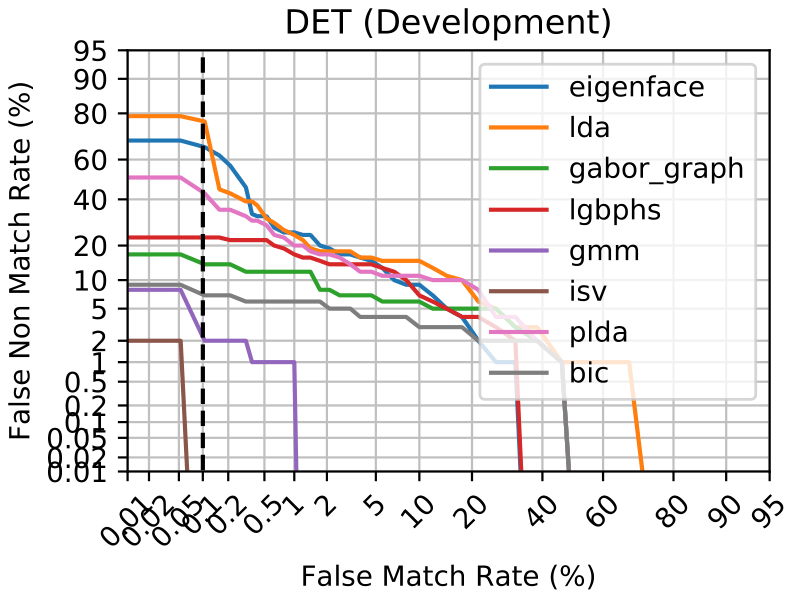
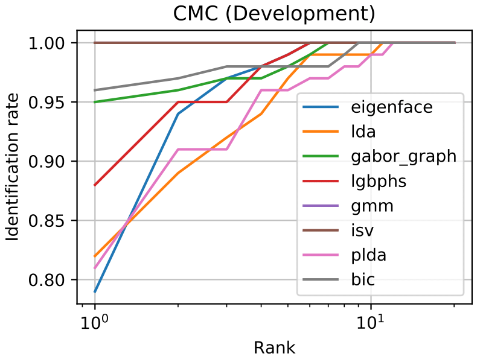

.. vim: set fileencoding=utf-8 :
.. author: Manuel Günther <manuel.guenther@idiap.ch>
.. date: Thu Sep 20 11:58:57 CEST 2012

.. _bob.bio.face.baselines:

=============================
Executing Baseline Algorithms
=============================

The first thing you might want to do is to execute one of the baseline face recognition algorithms that are implemented in ``bob.bio``.

Setting up your Database
------------------------

As mentioned in the documentation of :ref:`bob.bio.base <bob.bio.base>`, the image databases are not included in this package, so you have to download them.
For example, you can easily download the images of the `AT&T database`_, for links to other utilizable image databases please read the :ref:`bob.bio.face.databases` section.

By default, ``bob.bio`` does not know, where the images are located.
Hence, before running experiments you have to specify the image database directories.
How this is done is explained in more detail in the :ref:`bob.bio.base.installation`.

Running Baseline Experiments
----------------------------

To run the baseline experiments, you can use the ``bob bio baseline`` script by just going to the console and typing:

.. code-block:: sh

   $ bob bio baseline <baseline> <database>

This script is a simple wrapper for the ``verify.py`` script that is explained in more detail in :ref:`bob.bio.base.experiments`.
The ``bob bio baseline --help`` option shows you, which other options you have.
Here is an almost complete extract:

* ``<baseline>``: The recognition algorithms that you want to execute.  
* ``<database>``: The database and protocol you want to use.
* ``--temp-directory``: The directory where temporary files of the experiments are put to.
* ``--result-directory``: The directory where resulting score files of the experiments are put to.
* ``--verbose``: Increase the verbosity level of the script.
  By default, only the commands that are executed are printed, and the rest of the calculation runs quietly.
  You can increase the verbosity by adding the ``--verbose`` parameter repeatedly (up to three times).

Usually it is a good idea to have at least verbose level 2 (i.e., calling ``bob bio baseline --verbose --verbose``, or the short version ``bob bio baseline -vv``).

You can find the list of readily available baselines using the ``resources.py``
command:

.. code-block:: sh

    $ resources.py --types baseline

Running in Parallel
~~~~~~~~~~~~~~~~~~~

To run the experiments in parallel, as usual you can define an SGE grid configuration, or run with parallel threads on the local machine.
Hence, to run in the SGE grid, you can simply add the ``--grid`` command line option, without parameters.
Similarly, to run the experiments in parallel on the local machine, simply add a ``--parallel <N>`` option, where ``<N>`` specifies the number of parallel jobs you want to execute.

The Algorithms
--------------

The algorithms present an (incomplete) set of state-of-the-art face recognition algorithms. Here is the list of short-cuts:

* ``eigenface``: The eigenface algorithm as proposed by [TP91]_. It uses the pixels as raw data, and applies a *Principal Component Analysis* (PCA) on it:

  - preprocessor : :py:class:`bob.bio.face.preprocessor.FaceCrop`
  - feature : :py:class:`bob.bio.base.extractor.Linearize`
  - algorithm : :py:class:`bob.bio.base.algorithm.PCA`

* ``lda``: The LDA algorithm applies a *Linear Discriminant Analysis* (LDA), here we use the combined PCA+LDA approach [ZKC98]_:

  - preprocessor : :py:class:`bob.bio.face.preprocessor.FaceCrop`
  - feature : :py:class:`bob.bio.face.extractor.Eigenface`
  - algorithm : :py:class:`bob.bio.base.algorithm.LDA`

* ``gaborgraph``: This method extract grid graphs of Gabor jets from the images, and computes a Gabor phase based similarity [GHW12]_.

  - preprocessor : :py:class:`bob.bio.face.preprocessor.INormLBP`
  - feature : :py:class:`bob.bio.face.extractor.GridGraph`
  - algorithm : :py:class:`bob.bio.face.algorithm.GaborJet`

* ``plda``: *Probabilistic LDA* (PLDA) [Pri07]_ is a probabilistic generative version of the LDA, in its scalable formulation of [ESM13]_.
  Here, we also apply it on pixel-based representations of the image, though also other features should be possible.

  - preprocessor : :py:class:`bob.bio.face.preprocessor.FaceCrop`
  - feature : :py:class:`bob.bio.base.extractor.Linearize`
  - algorithm : :py:class:`bob.bio.base.algorithm.PLDA`

* ``bic``: In the *Bayesian Intrapersonal/Extrapersonal Classifier* (BIC) [MWP98]_, a gabor-grid-graph based similarity vector is classified to be intrapersonal (i.e., both images are from the same person) or extrapersonal, as explained in [GW09]_.

  - preprocessor : :py:class:`bob.bio.face.preprocessor.FaceCrop`
  - feature : :py:class:`bob.bio.face.extractor.GridGraph`
  - algorithm : :py:class:`bob.bio.base.algorithm.BIC`

Further algorithms are available, when the :ref:`bob.bio.gmm <bob.bio.gmm>` package is installed:

* ``gmm``: *Gaussian Mixture Models* (GMM) [MM09]_ are extracted from *Discrete Cosine Transform* (DCT) block features.

  - preprocessor : :py:class:`bob.bio.face.preprocessor.TanTriggs`
  - feature : :py:class:`bob.bio.face.extractor.DCTBlocks`
  - algorithm : :py:class:`bob.bio.gmm.algorithm.GMM`

* ``isv``: As an extension of the GMM algorithm, *Inter-Session Variability* (ISV) modeling [WMM11]_ is used to learn what variations in images are introduced by identity changes and which not.

  - preprocessor : :py:class:`bob.bio.face.preprocessor.TanTriggs`
  - feature : :py:class:`bob.bio.face.extractor.DCTBlocks`
  - algorithm : :py:class:`bob.bio.gmm.algorithm.ISV`

* ``ivector``: Another extension of the GMM algorithm is *Total Variability* (TV) modeling [WM12]_ (aka. I-Vector), which tries to learn a subspace in the GMM super-vector space.

  - preprocessor : :py:class:`bob.bio.face.preprocessor.TanTriggs`
  - feature : :py:class:`bob.bio.face.extractor.DCTBlocks`
  - algorithm : :py:class:`bob.bio.gmm.algorithm.IVector`

.. note::
  The ``ivector`` algorithm needs a lot of training data and fails on small databases such as the `AT&T database`_.

.. _bob.bio.base.baseline_results:

Baseline Results
----------------

Let's trigger the ``bob bio baseline`` script to run the baselines on the ATnT dataset:

.. code-block:: sh

  $ bob bio baseline eigenface atnt -vv -T <TEMP_DIR> -R <RESULT_DIR>
  $ bob bio baseline lda atnt -vv -T <TEMP_DIR> -R <RESULT_DIR>
  $ bob bio baseline gabor_graph atnt -vv -T <TEMP_DIR> -R <RESULT_DIR>
  $ bob bio baseline gmm atnt -vv -T <TEMP_DIR> -R <RESULT_DIR>
  $ bob bio baseline isv atnt -vv -T <TEMP_DIR> -R <RESULT_DIR>
  $ bob bio baseline plda atnt -vv -T <TEMP_DIR> -R <RESULT_DIR>
  $ bob bio baseline bic atnt -vv -T <TEMP_DIR> -R <RESULT_DIR>

Then, to evaluate the results, in terms of HTER, the script ``bob bio metrics`` should be executed as the following.

.. code-block:: sh

  $ bob bio metrics <RESULT_DIR>/atnt/eigenface/Default/nonorm/scores-dev \
                    <RESULT_DIR>/atnt/lda/Default/nonorm/scores-dev \
                    <RESULT_DIR>/atnt/gabor_graph/Default/nonorm/scores-dev \
                    <RESULT_DIR>/atnt/lgbphs/Default/nonorm/scores-dev \
                    <RESULT_DIR>/atnt/gmm/Default/nonorm/scores-dev \
                    <RESULT_DIR>/atnt/isv/Default/nonorm/scores-dev \
                    <RESULT_DIR>/atnt/plda/Default/nonorm/scores-dev \
                    <RESULT_DIR>/atnt/bic/Default/nonorm/scores-dev --no-evaluation

The aforementioned script will produce in the console the HTERs below for each baseline under the ATnT database:

.. table:: The HTER results of the baseline algorithms on the AT&T database

  +-------------+-------------+-------------+-------------+-------------+-------------+-------------+-------------+
  |  eigenface  |     lda     |  gaborgraph |    lgbphs   |     gmm     |     isv     |    plda     |     bic     |
  +=============+=============+=============+=============+=============+=============+=============+=============+
  |   9.0%      |    12.8%    |   6.0%      |    9.0%     |    1.0%     |    0.1%     |    10.8%    |    4.0%     |
  +-------------+-------------+-------------+-------------+-------------+-------------+-------------+-------------+

Several types of evaluation can be executed, see ``bob bio --help`` for details.
Particularly, here we can enable ROC curves, DET plots and CMC curves.

.. code-block:: sh

  $ bob bio roc <RESULT_DIR>/atnt/eigenface/Default/nonorm/scores-dev \
                <RESULT_DIR>/atnt/lda/Default/nonorm/scores-dev \
                <RESULT_DIR>/atnt/gabor_graph/Default/nonorm/scores-dev \
                <RESULT_DIR>/atnt/lgbphs/Default/nonorm/scores-dev \
                <RESULT_DIR>/atnt/gmm/Default/nonorm/scores-dev \
                <RESULT_DIR>/atnt/isv/Default/nonorm/scores-dev \
                <RESULT_DIR>/atnt/plda/Default/nonorm/scores-dev \
                <RESULT_DIR>/atnt/bic/Default/nonorm/scores-dev --no-evaluation \
                -o ROC.pdf
                
  $ bob bio det <RESULT_DIR>/atnt/eigenface/Default/nonorm/scores-dev \
                <RESULT_DIR>/atnt/lda/Default/nonorm/scores-dev \
                <RESULT_DIR>/atnt/gabor_graph/Default/nonorm/scores-dev \
                <RESULT_DIR>/atnt/lgbphs/Default/nonorm/scores-dev \
                <RESULT_DIR>/atnt/gmm/Default/nonorm/scores-dev \
                <RESULT_DIR>/atnt/isv/Default/nonorm/scores-dev \
                <RESULT_DIR>/atnt/plda/Default/nonorm/scores-dev \
                <RESULT_DIR>/atnt/bic/Default/nonorm/scores-dev --no-evaluation \
                -o DET.pdf

  $ bob bio cmc <RESULT_DIR>/atnt/eigenface/Default/nonorm/scores-dev \
                <RESULT_DIR>/atnt/lda/Default/nonorm/scores-dev \
                <RESULT_DIR>/atnt/gabor_graph/Default/nonorm/scores-dev \
                <RESULT_DIR>/atnt/lgbphs/Default/nonorm/scores-dev \
                <RESULT_DIR>/atnt/gmm/Default/nonorm/scores-dev \
                <RESULT_DIR>/atnt/isv/Default/nonorm/scores-dev \
                <RESULT_DIR>/atnt/plda/Default/nonorm/scores-dev \
                <RESULT_DIR>/atnt/bic/Default/nonorm/scores-dev --no-evaluation \
                -o CMC.pdf
               

For the `AT&T database`_ the results should be as follows:

.. image:: img/ROC.png
   :width: 35%

.. include:: links.rst
