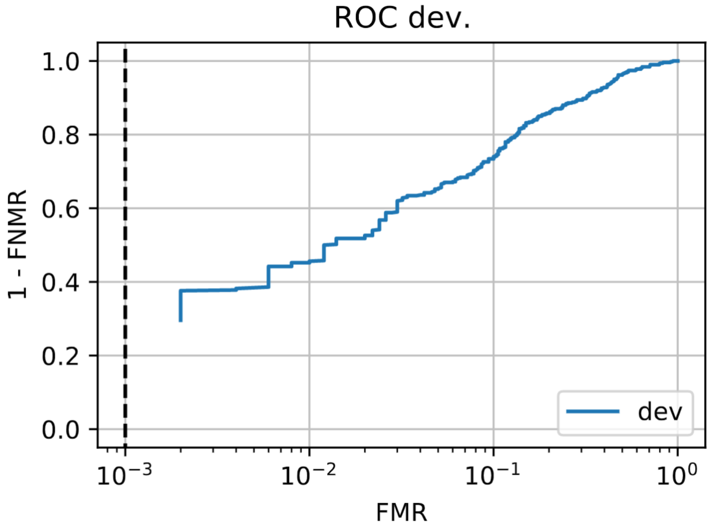

.. vim: set fileencoding=utf-8 :
.. author: Yu Linghu & Xinyi Zhang <yu.linghu@uzh.ch, xinyi.zhang@uzh.ch>

.. _bob.bio.face.deeplearningextractor:

==========================================================================
Extractors using Pretrained Deep Neural Networks with Different Interfaces
==========================================================================

In this page we introduce how to import and use the pretrained feature-extraction models in a face recognition experiment.

Extractor 
---------

As explained in :ref:`bob.bio.base <bob.bio.base>`, the extractor is a transformer that can reduce the dimensionality of preprocessed images so that the resulting feature vectors can ease the classification procedures (calculating the differences between individual’s vectors).  
 

 
Pretrained Models as Extractors
-------------------------------

The typical extractors like ``Discrete Cosine Transform (DCT)``, ``Gabor jets in a grid structure`` [GHW12]_, and ``Local Gabor Binary Pattern Histogram Sequences (LGBPHS)`` [ZSG05]_ are used before the deep learning era. To adapt to the deep learning era, the extractors introduced in this page are used to import the pretrained feature extraction models and weights. In other words, we use the preprocessed images as the inputs, import the pretrained model and its corresponding  weights, and plug inputs into the model to return the feature vectors. In this way, users can use their own or downloaded pretrained models to capture features. 
 
.. note::
  The following Interfaces are supported:
  
  MxNet
  
  PyTorch: Either import models by hand or call from Library
  
  TensorFlow
  
  OpenCV
  
  
  Please check the implementation details below.

Step By Step Instructions
-------------------------

1.   Download your desired model framework and pretrained weights.

2.   Specify the path to models before setting up the experiment configurations. 
    
    MxNet
       
    .. code-block:: sh
   
        $ bob config set bob.extractor_model.mxnet /PATH/TO/MODEL/
        $ bob config set bob.extractor_weights.mxnet /PATH/TO/WEIGHTS/

    OpenCV:
       
    .. code-block:: sh
   
        $ bob config set bob.extractor_model.opencv /PATH/TO/MODEL/
        $ bob config set bob.extractor_weights.opencv /PATH/TO/WEIGHTS/

    PyTorch:
       
    .. code-block:: sh
   
        $ bob config set bob.extractor_model.pytorch /PATH/TO/MODEL/
        $ bob config set bob.extractor_weights.pytorch /PATH/TO/WEIGHTS/
       
    PyTorch (Call from Library): No need to set the path, please define the model within the configuration file.
       
    TensorFlow:
       
    .. code-block:: sh
   
        $ bob config set bob.extractor_model.tf /PATH/TO/MODEL/

3.   Call the extractor in the configuration file. Example for MxNet:
       
    .. code-block:: sh
   
        from bob.bio.face.extractor import MxNetModel
        extractor_transformer = MxNetModel()

4.   Run the pipeline as usual.

 
Baselines
---------

The available baselines with the resulting ROC plots  for each interface are listed below.

MxNet
=====
*  ``mxnet-pipe``: Arcface Resnet Model using MxNet Interfaces from `Insightface <https://github.com/deepinsight/insightface>`_

1.   Set Path of Model
       
    .. code-block:: sh
   
        $ bob config set bob.extractor_model.mxnet /PATH/TO/MXNETMODEL/
        $ bob config set bob.extractor_weights.mxnet /PATH/TO/MXNETWEIGHTS/

2.   Call the extractor in the configuration
       
    .. code-block:: sh
   
        from bob.bio.face.extractor import MxNetModel
        extractor_transformer = MxNetModel()

In this baseline, we use :py:class:`bob.bio.face.preprocessor.FaceCrop` with  ``cropped_positions={'leye':(49,72), 'reye':(49,38)}`` 
and ``cropped_image_size=(112,112)`` 
as preprocessor,  `LResNet50E-IR,ArcFace@ms1m-refine-v1 <https://github.com/deepinsight/insightface/wiki/Model-Zoo#32-lresnet50e-irarcfacems1m-refine-v1>`_ as extractor and ``distance-cosine`` as the algorithm. By testing on LFW database, we get the following ROC plot:

  ROC plot for LFW database using the pretrained extractor with MxNet Interface.

OpenCV
======
* ``opencv-pipe``: VGG Face descriptor pretrained models, i.e. `Caffe model <https://www.robots.ox.ac.uk/~vgg/software/vgg_face/>`_

1.   Set Path of Model
       
   .. code-block:: sh
   
      $ bob config set bob.extractor_model.opencv /PATH/TO/OPENCVMODEL/
      $ bob config set bob.extractor_weights.opencv /PATH/TO/OPENCVWEIGHTS/

2.   Call the extractor in the configuration
       
   .. code-block:: sh
   
      from bob.bio.face.extractor import OpenCVModel
      extractor_transformer = OpenCVModel()

In this baseline, we use :py:class:`bob.bio.face.preprocessor.FaceCrop` with  ``cropped_positions={"leye": (98, 144), "reye": (98, 76)}`` 
and ``cropped_image_size=(224,224)`` 
as preprocessor,  vgg_face_caffe.tar.gz <https://www.robots.ox.ac.uk/~vgg/software/vgg_face/>`_ as extractor, and ``distance-cosine`` as the algorithm. By testing on LFW database, we get the following ROC plot:

  ROC plot for LFW database using the pretrained CAFFE extractor with OpenCV Interface.

PyTorch
=======
* ``pytorch-pipe-v1``: Pytorch network that extracts 1000-dimensional features, trained by Manual Gunther, as described in [LGB18]_

1.   Set Path of Model
       
   .. code-block:: sh
   
      $ bob config set bob.extractor_model.pytorch /PATH/TO/PYTORCHMODEL/
      $ bob config set bob.extractor_weights.pytorch /PATH/TO/PYTORCHWEIGHTS/

2.   Call the extractor in the configuration
       
   .. code-block:: sh
   
      from bob.bio.face.extractor import PyTorchLoadedModel
      extractor_transformer = PyTorchLoadedModel()

In this baseline, we use :py:class:`bob.bio.face.preprocessor.FaceCrop` with  ``cropped_positions={'leye':(110,144), 'reye':(110,96)}``
 and ``cropped_image_size=(224,224)`` 
 as preprocessor,  a PyTorch model describ  in [LGB18]_  as extractor, and ``distance-cosine`` as the algorithm. By testing on LFW database, we get the following ROC plot:

  ROC plot for LFW database using the pretrained extractor with PyTorch Interface.

PyTorch Import from Library
===========================
* ``pytorch-pipe-v2``: Inception Resnet face recognition model from `facenet_pytorch <https://github.com/timesler/facenet-pytorch>`_

1.   Call the extractor and model in the configuration
       
    .. code-block:: sh
   
        from bob.bio.face.extractor import PyTorchLoadedModel
        from facenet_pytorch import InceptionResnetV1
        model = InceptionResnetV1(pretrained='vggface2').eval()
        extractor_transformer = PyTorchLibraryModel(model=model)

In this baseline, we use :py:class:`bob.bio.face.preprocessor.FaceCrop` with  ``cropped_positions={'leye':(110,144), 'reye':(110,96)}`` 
and ``cropped_image_size=(224,224)`` 
as preprocessor,  `facenet_pytorch <https://github.com/timesler/facenet-pytorch>`_  as extractor, and ``distance-cosine`` as the algorithm. By testing on LFW database, we get the following ROC plot:

  ROC plot for LFW database using the pretrained extractor called directly from PyTorch library.

TensorFlow
==========
* ``tf-pipe``: Inception Resnet v2 model trained using the MSCeleb dataset in the context of the work published by [TFP18]_

1.   Set Path of Model
       
    .. code-block:: sh
   
        $ bob config set bob.extractor_model.pytorch /PATH/TO/PYTORCHMODEL/
        $ bob config set bob.extractor_weights.pytorch /PATH/TO/PYTORCHWEIGHTS/

2.   Call the extractor in the configuration
       
    .. code-block:: sh
   
        from bob.bio.face.extractor import PyTorchLoadedModel
        extractor_transformer = PyTorchLoadedModel()

In this baseline, we use :py:class:`bob.bio.face.preprocessor.FaceCrop` with  ``cropped_positions={'leye':(80,100), 'reye':(80,60)}`` 
and ``cropped_image_size=(160,160)`` 
as preprocessor,  Inception Resnet v2  in [TFP18]_ as extractor, and ``distance-cosine`` as the algorithm. By testing on LFW database, we get the following ROC plot:

  ROC plot for LFW database using the pretrained extractor with TensorFlow Interface.

Special Case: What if none of the above interfaces are compatible with  your model?
-----------------------------------------------------------------------------------
Please use `MMDNN  <https://github.com/microsoft/MMdnn>_` to convert your model into the available interfaces.

