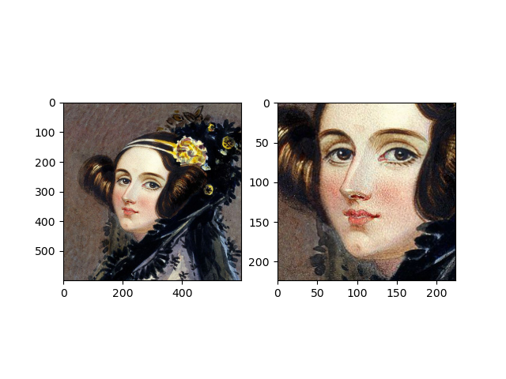

.. _bob.bio.face.faq:

===
FAQ
===

How to crop a face ?
====================

The recipe below helps you to set a face cropper based on eye positions.

.. literalinclude:: faq/facecrop.py

How to choose the cropped positions ?
=====================================

The ideal cropped positions are dependent on the specific application you are using the face cropper in.
Some face embedding extractors work well on loosely cropped faces, while others require the face to be tightly cropped.
We provide a few reasonable defaults that are used in our implemented baselines. They are accessible through an utilitary function as follows :
::

    from bob.bio.face.config.baseline.helpers import get_default_cropped_positions
    mode = 'legacy'
    cropped_image_size=(160, 160)
    annotation_type='eyes-center'
    cropped_positions = get_default_cropped_positions(mode, cropped_image_size, annotation_type)

There are currently three available modes :

* :code:`legacy` Tight crop, used in non neural-net baselines such as :code:`gabor-graph`, :code:`lgbphs` or :code:`lda`. 
  It is typically use with a 5:4 aspect ratio for the :code:`cropped_image_size`
* :code:`dnn` Loose crop, used for neural-net baselines such as the ArcFace or FaceNet models.
* :code:`pad` Tight crop used in some PAD baselines

We present hereafter a visual example of those crops for the `eyes-center` annotation type.

    Original face image

.. figure:: img/cropping_example_legacy.png
    :height: 250px
    :align: right
    :alt: Legacy crop
    :figclass: align-center

    Legacy crop (160 x 128)

    DNN crop (160 x 160)

    PAD crop (160 x 160)
    