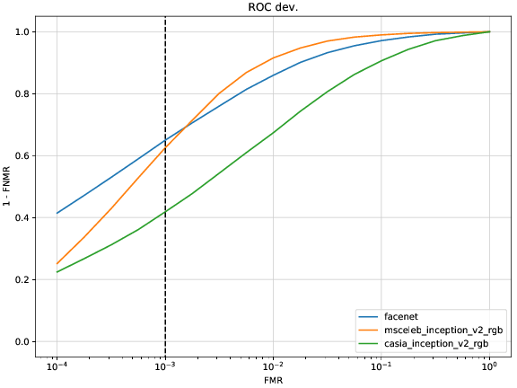

.. vim: set fileencoding=utf-8 :

.. _bob.bio.face.leaderboard.ijbc:

=============
IJB-C Dataset
=============

The IARPA Janus Benchmark C (IJB-C) is one of the most challenging evaluation datasets in face recognition research.
This dataset contains evaluation protocols for face detection, face clustering, face verification, and open-set face identification.
Included in the database, there are list files defining verification as well open-set identification protocols.
For verification, two different protocols are provided (`ijbc-test1` and `ijbc-test2`) so as for the open-set (`ijbc-test4-g1` and `ijbc-test4-g2`).

Setting up the database
=======================

To use this dataset protocol, you need to have the original files of the IJBC datasets.
Once you have it downloaded, please run the following command to set the path for Bob

   .. code-block:: sh

      bob config set bob.bio.face.ijbc.directory [IJBC PATH]

Benchmarking
============

You can run the IJBC baselines command with a simple command such as:

.. code-block:: bash

   bob bio pipeline simple ijbc-test4-g1 iresnet100

The above command will run an example of open set face recognition.

.. note::

   Use ``bob bio pipeline simple --dump-config default.py`` to generate a file
   containing all the possible parameters and option of that command with the default
   value assigned, but also all the possible values for each parameter as comment.

:ref:`bob.bio.face` has some customized plots where the FMR and FNMR trade-off in the
evaluation set can be plotted using operational FMR thresholds from the development
set. This is done be the command `bob bio face plots ijbc` command as in the example
below:

.. code-block:: bash

   wget https://www.idiap.ch/software/bob/data/bob/bob.bio.face/master/scores/frice_scores.tar.gz
   tar -xzvf frice_scores.tar.gz
   bob bio face plots ijbc \
        ./frice_scores/ijbc/arcface_insightface/scores-dev.csv \
        ./frice_scores/ijbc/resnet50_msceleb_arcface_20210521/scores-dev.csv \
        ./frice_scores/ijbc/attention_net/scores-dev.csv \
        ./frice_scores/ijbc/facenet_sanderberg/scores-dev.csv \
        --titles ArcFace-100,Idiap-Resnet50,Zoo-AttentionNet,Facenet-Sandberg -o plot.pdf

.. YD2022: TODO
.. What follows was copied directly from bob.bio.face_ongoing documentation.
.. THIS IS NOT UP TO DATE.
.. Please replace this with the new numbers and remove this comment when re-running the
.. experiments.

Results
=======

Verification protocol 1:1
*************************

This section presents the results for verification (1:1) protocol.
Check `here <https://www.idiap.ch/software/bob/docs/bob/bob.db.ijbc/stable/index.html>`_ for more details.

+----------------------------------------------+-----------------+-----------------+-----------------+
| System                                       | TPIR% (FAR=0.1) | TPIR% (FAR=0.01)|TPIR% (FAR=0.001)|
+==============================================+=================+=================+=================+
| VGG16                                        |                 |                 |                 |
+----------------------------------------------+-----------------+-----------------+-----------------+
| Facenet                                      | 97.137          | 85.944          | 64.979          |
+----------------------------------------------+-----------------+-----------------+-----------------+
| Dr GAN                                       | 90.397          | 62.152          | 31.912          |
+----------------------------------------------+-----------------+-----------------+-----------------+
| CasiaNET                                     | 17.799          | 4.341           | 0.92            |
+----------------------------------------------+-----------------+-----------------+-----------------+
| CNN8                                         | 17.871          | 4.709           | 0.997           |
+----------------------------------------------+-----------------+-----------------+-----------------+
| Casia WebFace - Resnetv1 center loss gray    | 90.597          | 67.945          | 41.402          |
+----------------------------------------------+-----------------+-----------------+-----------------+
| Casia WebFace - Resnetv1 center loss rgb     | 90.985          | 68.4            | 42.041          |
+----------------------------------------------+-----------------+-----------------+-----------------+
| Casia WebFace - Resnetv2 center loss gray    | 90.806          | 66.754          | 39.577          |
+----------------------------------------------+-----------------+-----------------+-----------------+
| Casia WebFace - Resnetv2 center loss rgb     | 90.633          | 67.388          | 41.837          |
+----------------------------------------------+-----------------+-----------------+-----------------+
| MSCeleba      - Resnetv2 center loss rgb     | 99.0            | 91.55           | 62.53           |
+----------------------------------------------+-----------------+-----------------+-----------------+

Follow below the ROC curve of the three best evaluated systems.

.. YD2022: TODO Update this picture too.
