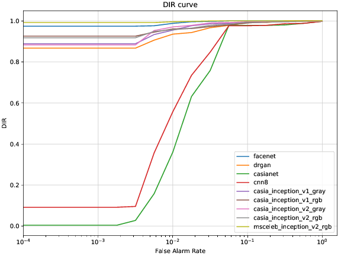

.. vim: set fileencoding=utf-8 :

.. _bob.bio.face.leaderboard.lfw:

===========
LFW Dataset
===========

Results
=======

.. YD2022: TODO
.. What follows was copied directly from bob.bio.face_ongoing documentation.
.. THIS IS NOT UP TO DATE.
.. Please replace this with the new numbers and remove this comment when re-running the
.. experiments.

LFW presents a 10 fold evaluation protocol for **open-set identification**.
Follow below the average True Positive Identification Rate measures under different False Alarm Rates (10 folds averaging).

  +---------------------------------------------+-----------------+-----------------+-----------------+
  | System                                      | TPIR% (FAR=0.1) | TPIR% (FAR=0.01)|TPIR% (FAR=0.001)|
  +=============================================+=================+=================+=================+
  | VGG16                                       |                 |                 |                 |
  +---------------------------------------------+-----------------+-----------------+-----------------+
  | Facenet                                     | 99.6  (0.66)    | 98.37 (0.82)    | 93.13  (3.71)   |
  +---------------------------------------------+-----------------+-----------------+-----------------+
  | Dr GAN                                      | 97.45 (0.96)    | 88.41 (1.81)    | 75.27  (10.12)  |
  +---------------------------------------------+-----------------+-----------------+-----------------+
  | CasiaNET                                    | 96.81 (0.91)    | 52.0 (8.87)     | 13.13  (6.76)   |
  +---------------------------------------------+-----------------+-----------------+-----------------+
  | CNN8                                        | 96.93 (0.83)    | 45.55 (11.85)   | 15.63  (10.98)  |
  +---------------------------------------------+-----------------+-----------------+-----------------+
  | Casia WebFace - Resnetv1 cross  loss gray   | 98.29 (0.91)    | 93.18 (1.57)    | 79.16 (9.6)     |
  +---------------------------------------------+-----------------+-----------------+-----------------+
  | Casia WebFace - Resnetv1 cross loss rgb     | 98.36 (0.56)    | 92.53 (1.54)    | 77.53 (11.13)   |
  +---------------------------------------------+-----------------+-----------------+-----------------+
  | Casia WebFace - Resnetv2 center loss gray   | 98.51 (0.64)    | 91.68 (2.13)    | 79.91  (4.97)   |
  +---------------------------------------------+-----------------+-----------------+-----------------+
  | Casia WebFace - Resnetv2 center loss rgb    | 98.58 (0.65)    | 92.18 (1.68)    | 78.9  (10.35)   |
  +---------------------------------------------+-----------------+-----------------+-----------------+
  | MSCeleb - Resnetv2 center loss rgb          | 99.77 (0.19 )   | 99.18 (0.43 )   | 77.75 (30.82)   |
  +---------------------------------------------+-----------------+-----------------+-----------------+

Since these protocols are open-set, another way analyze this dataset is via an Open Set Identification evaluation.
Follow below Detection Identification Rate for the first fold.

.. YD2022: TODO Update this picture too.
