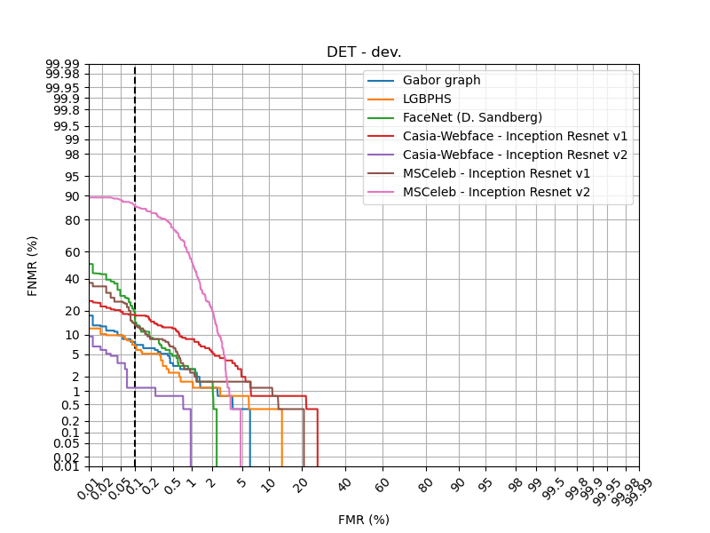
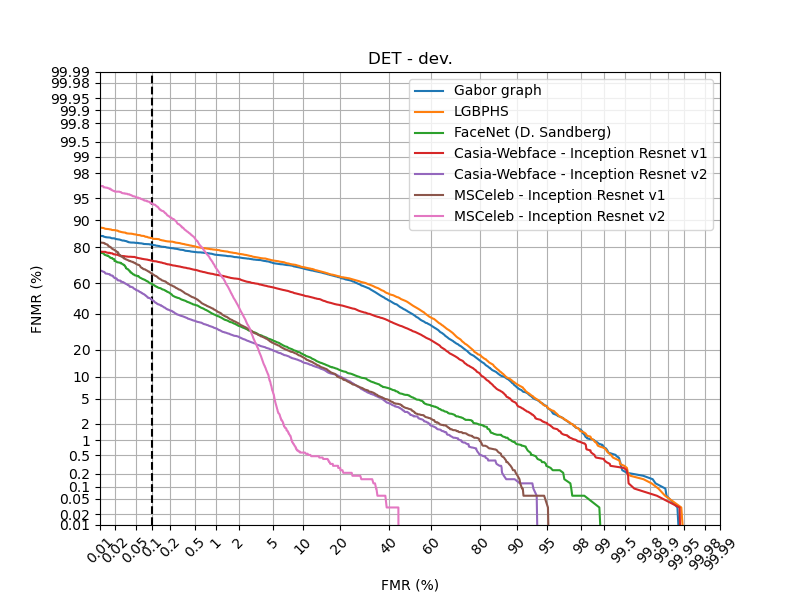
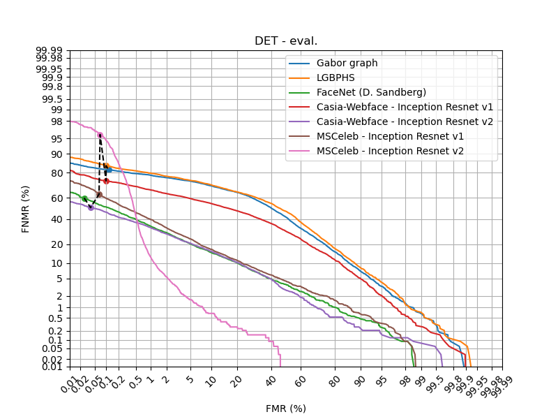

.. vim: set fileencoding=utf-8 :

.. _bob.bio.face.leaderboard.multipie:

================
Multipie Dataset
================

.. todo::
   Benchmarks on Multipie Database

   Probably for Manuel's students

Database
========
The `CMU Multi-PIE face database <http://www.cs.cmu.edu/afs/cs/project/PIE/MultiPie/Multi-Pie/Home.html>`_ contains more than 750,000 images 
of 337 people recorded in up to four sessions over the span of five months. Subjects were imaged under 15 view points and 19 illumination 
conditions while displaying a range of facial expressions. In addition, high resolution frontal images were acquired as well. 
In total, the database contains more than 305 GB of face data. 

Content
*******
The data has been recorded over 4 sessions. For each session, the subjects were asked to display a few
different expressions. For each of those expressions, a complete set of 30 pictures is captured that includes
15 different view points times 20 different illumination conditions (18 with various flashes, plus 2 pictures with no flash at all). 

Available expressions
---------------------
* Session 1 : *neutral*, *smile*
* Session 2 : *neutral*, *surprise*, *squint*
* Session 3 : *neutral*, *smile*, *disgust*
* Session 4 : *neutral*, *neutral*, *scream*.

Camera and flash positioning
----------------------------
The different view points are obtained by a set of 13 cameras located at head height, spaced at 15° intervals,
from the -90° to the 90° angle, plus 2 additional cameras located above the subject to simulate a typical
surveillance view. A flash coincides with each camera, and 3 additional flashes are positioned above the subject, for a total
of 18 different possible flashes.

The following picture showcase the positioning of the cameras (in yellow) and of the flashes (in white).

File paths
----------

The data directory structure and filenames adopt the following structure:
 
.. code-block:: shell
   
   session<XX>/multiview/<subject_id>/<recording_id>/<camera_id>/<subject_id>_<session_id>_<recording_id>_<camera_id>_<shot_id>.png

For example, the file

.. code-block:: shell
   
   session02/multiview/001/02/05_1/001_02_02_051_07.png

corresponds to
* Subject 001
* Session 2
* Second recording -> Expression is *surprise*
* Camera 05_1 -> Frontal view
* Shot 07 -> Illumination through the frontal flash

Protocols
*********

Expression protocol
-------------------
**Protocol E**

* Only frontal view (camera 05_1); only no-flash (shot 0)
* Enrolled : 1x neutral expression (session 1; recording 1)
* Probes : 4x neutral expression + other expressions (session 2, 3, 4; all recordings)

Pose protocol
-------------
**Protocol P**

* Only neutral expression (recording 1 from each session, + recording 2 from session 4); only no-flash (shot 0)
* Enrolled : 1x frontal view (session 1; camera 05_1)
* Probes : all views from cameras at head height (i.e excluding 08_1 and 19_1), including camera 05_1 from session 2,3,4.

Illumination protocols
----------------------
N.B : shot 19 is never used in those protocols as it is redundant with shot 0 (both are no-flash).

**Protocol M**

* Only frontal view (camera 05_1); only neutral expression (recording 1 from each session, + recording 2 from session 4)
* Enrolled : no-flash (session 1; shot 0)
* Probes : no-flash (session 2, 3, 4; shot 0)

**Protocol U**

* Only frontal view (camera 05_1); only neutral expression (recording 1 from each session, + recording 2 from session 4)
* Enrolled : no-flash (session 1; shot 0)
* Probes : all shots from session 2, 3, 4, including shot 0.

**Protocol G**

* Only frontal view (camera 05_1); only neutral expression (recording 1 from each session, + recording 2 from session 4)
* Enrolled : all shots (session 1; all shots)
* Probes : all shots from session 2, 3, 4.

Benchmarks
==========

Run the baselines
*****************

You can run the Multipie baselines command with a simple command such as:

.. code-block:: bash

    bob bio pipeline vanilla-biometrics multipie gabor_graph -m -l sge

Note that the default protocol implemented in the resource is the U protocol.
The pose protocol is also available using

.. code-block:: bash

    bob bio pipeline vanilla-biometrics multipie_pose gabor_graph -m -l sge

For the other protocols, one has to define its own configuration file (e.g.: *multipie_M.py*) as follows:

.. code-block:: python

    from bob.bio.face.database import MultipieDatabase
    database = MultipieDatabase(protocol="M")

then point to it when calling the pipeline execution:

.. code-block:: bash

    bob bio pipeline vanilla-biometrics multipie_M.py gabor_graph -m -l sge

Leaderboard
***********

Protocol M
----------

.. csv-table:: Protocol M
   :file: table/multipie/multipie_M.csv
   :header-rows: 1

Protocol U
----------

.. csv-table:: Protocol U
   :file: table/multipie/multipie_U.csv
   :header-rows: 1

Protocol E
----------

.. csv-table:: Protocol E
   :file: table/multipie/multipie_E.csv
   :header-rows: 1

Protocol P
----------

.. csv-table:: Protocol P
   :file: table/multipie/multipie_P.csv
   :header-rows: 1

For the pose protocol specifically, we can perform a more detailed study
to assess angle-wise performance of the various FR systems.
Hereafter is an example code to run this type of analysis, as well 
as the results. This code is also available as a Jupytext-compatible
.py file under `./script/multipie/pose_analysis.py`, that can be loaded 
as a Jupyter notebook.

.. raw:: html
    :file: script/multipie/pose_analysis.html

