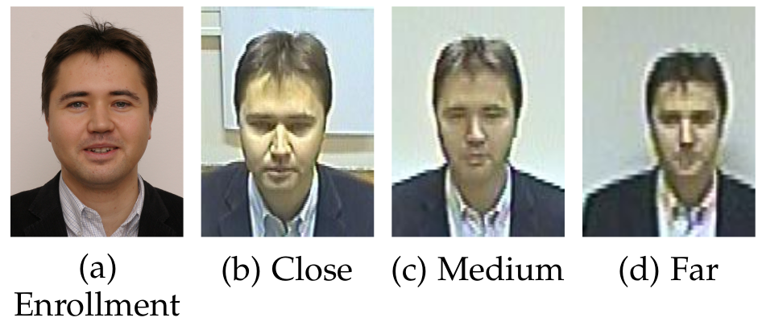

.. vim: set fileencoding=utf-8 :

.. _bob.bio.face.learderboard.scface:

==============
SCFace Dataset
==============

SCface is a database of static images of human faces.
Images were taken in uncontrolled indoor environment using five video surveillance cameras of various qualities.
Database contains 4160 static images (in visible and infrared spectrum) of 130 subjects.
Images from different quality cameras mimic the real-world conditions and enable robust face recognition algorithms testing, emphasizing different
law enforcement and surveillance use case scenarios.

The surveillance camera face (SCface) dataset \cite{scface} contains images taken by different low-resolution video surveillance cameras at three different distances.
The dataset has three types of images and they are close, medium, and far.
44 identities are used in the dev set, and 43 for the in the evaluation set.
One frontal image taken in passport quality as shown in scface:enroll is used for model enrollment, which differs dramatically in quality
from the probe images as we can see in the image below.

Setting up the database
=======================

To use this dataset protocol, you need to have the original files of the Mobio dataset.
Once you have it downloaded, please run the following command to set the path for Bob

   .. code-block:: sh

      bob config set bob.bio.face.scface.directory [SCFACE PATH]

Benchmarking
============

You can run the scface baselines command with a simple command such as:

.. code-block:: bash

   bob bio pipeline simple scface iresnet100

:ref:`bob.bio.face` has some customized plots where the FMR and FNMR trade-off in the evaluation set can be plot using operational
FMR thresholds from the development set.
This is done be the command `bob bio face plots scface` command as in the example below:

.. code-block:: bash

   wget https://www.idiap.ch/software/bob/data/bob/bob.bio.face/master/scores/frice_scores.tar.gz
   tar -xzvf frice_scores.tar.gz
   bob bio face plots scface -e \
        ./frice_scores/scface/arcface_insightface/scores-{dev,eval}.csv \
        ./frice_scores/scface/iresnet50_msceleb_arcface_20210623/scores-{dev,eval}.csv \
        ./frice_scores/scface/attention_net/scores-{dev,eval}.csv \
        ./frice_scores/scface/facenet_sanderberg/scores-{dev,eval}.csv \
        ./frice_scores/scface/ISV/scores-{dev,eval}.csv \
        --titles ArcFace-100,Idiap-Resnet50,Zoo-AttentionNet,Facenet-Sandberg,2014-ISV -o plot.pdf

.. note::
  Always remember, `bob bio face plots --help` is your friend.
